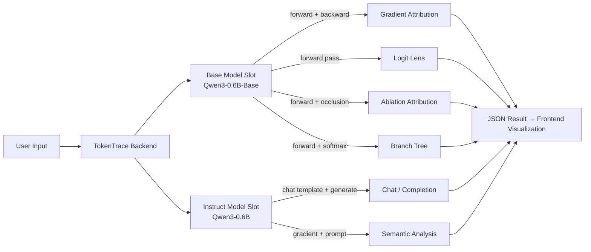

# TokenTrace 🔬

> *Trace how every token shapes an LLM's predictions.*

**🌐 Live Demo**: [huggingface.co/spaces/Girlz/TokenTrace](https://huggingface.co/spaces/Girlz/TokenTrace)

**TokenTrace** is an interactive toolbox for exploring **how and why LLMs predict what they do**. It visualizes token-level attributions, layer-by-layer information flow, semantic relevance, and generation branching — all through a beautiful web UI.

---

## ✨ Features

### 🎯 Prediction Attribution
See which tokens in your input most influenced the model's next-token prediction. Uses gradient-based saliency (L2 norm of embedding gradients) to rank each token's contribution.

### 🔪 Ablation Attribution
Measure the impact of each token by occluding it and observing the probability change (ΔP = baseline − occluded). A counterfactual approach to understanding token importance.

### 📊 Logit Lens
Watch how the model's prediction "crystallizes" layer by layer. Each Transformer layer's hidden state is projected back to vocabulary space, revealing how information accumulates through the network depth.

### 🌳 Branch Tree
Visualize the top-k candidate tokens at every step of generation. Explore alternative paths the model could have taken — a probability tree that reveals the model's uncertainty and decision landscape.

### 📝 Information Density Analysis
Analyze which tokens carry the most "information content" using gradient-based methods. Distinguish high-information tokens (nouns, verbs) from low-information ones (stop words, punctuation).

### 🔍 Semantic Relevance Analysis
Given a query, score every token in a text by its relevance to that query. Uses logits gradient with a fill-in-the-blank prompt strategy to extract fine-grained relevance scores.

### 💬 Chat & Generation
OpenAI-compatible completions endpoint with SSE streaming. Supports chat templates, tool calling visualization, and multi-turn causal flow tracing.

### 🔄 Causal Flow
Multi-turn generation with per-token attribution at every step. Trace the full causal chain from input to output across multiple rounds of tool calling and generation.

---

## 🚀 Quick Start

### Run Locally with Docker

```bash
# 1. Build the image
docker build -t tokentrace .

# 2. Run the container
docker run -p 7860:7860 tokentrace

# 3. Visit http://localhost:7860
```

### Local Development

```bash
# Backend
pip install -r requirements.txt
python run.py --no_auto_load --base_model qwen3-0.6b --instruct_model qwen3-0.6b-instruct

# Frontend (separate terminal)
cd client/src && npm install && npm run build
```

---

## 🧠 How It Works



The backend runs two model slots in PyTorch:
- **Base slot**: For analysis tasks (attribution, logit lens, branching) — Qwen3-0.6B-Base
- **Instruct slot**: For chat and semantic analysis — Qwen3-0.6B

All analysis is done locally on CPU (free tier) or GPU (if available), with gradient checkpointing to minimize memory usage.

---

## 🗺️ Feature Map

| Page | Path | Purpose | Requires |
|------|------|---------|----------|
| Home | `/` | Overview & navigation | Static |
| Analysis | `/client/analysis.html` | Information density & semantic analysis | Base slot |
| Attribution | `/client/attribution.html` | Prediction & ablation attribution | Base slot |
| Chat | `/client/chat.html` | Chat completion with tool calling | Instruct slot |
| Logit Lens | `/client/logit_lens.html` | Layer-by-layer prediction projection | Base slot |
| Branch Tree | `/client/branch_tree.html` | Next-token probability tree | Base slot |
| Causal Flow | `/client/causal_flow.html` | Multi-turn generation + attribution | Both slots |

---

## ⚙️ Configuration

Key environment variables:

| Variable | Purpose |
|----------|---------|
| `FORCE_INT8=1` | Enable INT8 quantization (CPU, saves ~50% memory) |
| `FORCE_CPU=1` | Force CPU mode |
| `HF_HUB_ENABLE_HF_TRANSFER=1` | Accelerate model downloads |
| `INFORADAR_ADMIN_TOKEN` | Admin token for model switching & demo management |

---

## 📜 License

[Apache 2.0](LICENSE). Copyright and attribution notices remain in [NOTICE](NOTICE).

---

## 🙏 Fork Attribution

This project is forked from [InfoLens](https://huggingface.co/spaces/dqy08/InfoLens) by [dqy08](https://huggingface.co/dqy08), with enhancements and adaptations for the Hugging Face Spaces free tier.