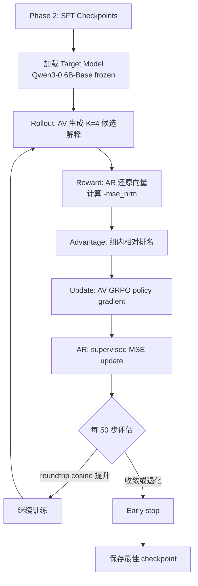

# Tiny NLA v2 Implementation Plan

> 目标：修复三个关键问题，让 Tiny NLA 项目从「SFT 概念验证」升级到「符合 Anthropic NLA 方案的完整训练闭环」

## 问题总览

| 优先级 | 问题 | 当前状态 | 目标状态 |
|:------:|------|----------|----------|
| P0 | 缺少 RL（GRPO）训练循环 | 只有 SFT，没有 RL | 实现 AV+AR 联合 GRPO RL，reward = `-mse_nrm` |
| P0 | Teacher label 带了太多辅助信息 | prompt 包含 context、top_tokens、pos 等 | 简化到仅依赖激活向量本身的信息 |
| P1 | 数据量太小（1461 vs 1M） | 22 条句子，284→1461 records | 扩大到 ≥10K 条 records |

---

## Phase 0: 数据扩容（P1 — 数据量）

> **依赖**：无，可独立进行
> **预计耗时**：4-6 小时（大部分是 API 调用等待时间）

### Step 0.1: 扩大语料库到 ≥500 条句子

**文件**：`experiments/tiny_nla/expand_dataset_v2.py`（新文件）

当前 `expand_dataset.py` 用 15 个领域生成 ~300 条句子。需要扩大到 500+ 条。

**策略**：
- 扩展领域列表到 30+ 个（增加：心理学、心理学、编程技术、数学逻辑、影视娱乐、宗教信仰、语言语言学、艺术美学、交通出行、宠物动物、天气气候、金融投资、职场沟通）
- 每个领域生成 20-30 条
- 用 opencode CLI 并发批量生成（参考现有 `batch_teacher_labels.py` 的并发模式）
- 增加句子多样性：短句（8-15字）、中等句（15-30字）、长句（30-50字）

**输出**：`artifacts/tiny_nla/expanded_texts_v2.json`（500+ 条句子）

### Step 0.2: 提取全部激活向量

**文件**：`experiments/tiny_nla/generate_data_v2.py`（新文件，基于现有 `generate_data.py`）

- 加载 Qwen3-0.6B-Base
- 对 500+ 条句子做 forward pass，提取 layer 19 的残差流
- 每条句子每个 token 都提取（不需要过滤）
- 保存为 parquet 格式（与 Anthropic NLA 对齐）

**输出**：`artifacts/tiny_nla/activations_v2.parquet`

**预估**：500 条句子 × ~15 tokens/句 = ~7,500 activation records。以 0.6B 模型在 M4 Pro 上，forward pass 极快（<5 分钟全部完成）。

### Step 0.3: 过滤 OOD 样本

- 去掉 activation_norm > 2000 的首 token（与现有做法一致）
- 去掉 norm < 50 的异常低激活（可能是 padding/特殊 token）
- 预估保留 ~7,000 条 in-distribution records

---

## Phase 1: Teacher Label 重做（P0 — 辅助信息）

> **依赖**：Phase 0 完成后的数据
> **预计耗时**：8-12 小时（API 调用）

### Step 1.1: 设计简化版 Teacher Prompt

**核心原则**：NLA 的目标是让 AV **仅从激活向量**推断语义。Teacher label 的训练数据不应包含 AV 运行时看不到的信息。

**Anthropic 方案对比**：
Anthropic 的 teacher 生成用的是 **Claude 看 activation 向量的投影/统计信息**，不附带原始句子或 top_tokens。

**新 prompt 设计**：

```
你是一个语言模型内部机制分析专家。我给你一段来自 Qwen3-0.6B 模型（layer 19，residual stream）
在某 token 位置的激活向量信息，请你推断这个位置编码了什么语义。

激活向量统计信息：
- L2 norm: {norm}
- 与平均激活方向的余弦相似度: {cosine_with_mean}
- 该位置在序列中的相对位置: {relative_pos}（0=开头, 1=末尾）

请用1-2句简洁中文描述你认为这个位置编码的语义信息。
要求：简洁具体，不超过55字，只输出解释本身。
```

**关键变化**：
- ❌ 去掉原始句子文本（context）
- ❌ 去掉 top_tokens（模型预测候选）
- ❌ 去掉 token_text（当前 token 文本）
- ✅ 只给激活向量的**统计特征**（norm、方向、相对位置）
- ✅ 这些信息 AV 在推理时可以通过注入的向量获得

**为什么可以去掉 context/top_tokens**：
- Anthropic 的论文明确指出，NLA 的核心价值在于**从向量本身推断语义**
- 如果 teacher 依赖了上下文，AV 就不需要学会「读懂向量」，而是学会了「从 prompt 里偷看上下文」
- RL 训练时，reward 只看「向量→文本→向量」的 roundtrip 质量，上下文信息不会被注入

### Step 1.2: 批量生成简化版 Teacher Labels

**文件**：`experiments/tiny_nla/generate_teacher_labels_v2.py`（新文件）

**API 方案：双通道并发**

为最大化吞吐量，同时使用两个免费 API 通道：

| 通道 | API | 模型 | 并发数 | 特点 |
|------|-----|------|:------:|------|
| 通道 A | opencode CLI | deepseek-v4-flash-free | 4 workers | 本地 CLI 调用，已在用 |
| 通道 B | NVIDIA API | deepseek-ai/deepseek-v4-pro | 8-10 concurrent | 直接 HTTP API，更快更强 |

**NVIDIA API 配置**：
```python
from openai import OpenAI

nvidia_client = OpenAI(
    base_url="https://integrate.api.nvidia.com/v1",
    api_key=os.environ.get("NVIDIA_API_KEY", ""),
)
# model: "deepseek-ai/deepseek-v4-pro"
# thinking=False → 直接输出，不需要等思考过程
# max_tokens=256 足够（teacher label ≤55字）
```

**并发策略**：
- opencode CLI：4 个 subprocess worker（需要达到 free tier 并发上限，我不确定4个是否是上限）
- NVIDIA API：8-10 个 asyncio concurrent request（NVIDIA free tier 通常允许较高并发）
- **总计 12-14 个并发请求**，吞吐量提升约 3 倍

**优势对比**：
| 方案 | 速度 | 模型质量 | 成本 |
|------|------|---------|------|
| opencode CLI (flash-free) | ~3-5 秒/条 | DeepSeek V4 Flash | 免费 |
| NVIDIA API (v4-pro) | ~2-3 秒/条 | DeepSeek V4 Pro（更强） | 免费 |
| **双通道合计** | **~12-14 条/分钟** | 混合质量 | **免费** |

**容错与 checkpoint**：
- 每 100 条保存 checkpoint（JSON 文件）
- 两个通道的结果合并写入同一个文件
- 支持 `--skip-existing`，中断后重启自动跳过已完成
- NVIDIA API 失败时自动重试 3 次，最终 fallback 到 opencode

**预估**：7000 条 ÷ 20 条/分钟 = **~6 小时**（比纯 opencode 方案快 ~5 倍）

**输出**：`artifacts/tiny_nla/teacher_labels_v2.json`

### Step 1.3: 质量检查

- 检查是否有空输出或幻觉（声称上下文包含某些不存在的内容）
- 剔除长度 > 55 字的过长解释
- 剔除明显泛泛而谈的解释（如「编码了关键语义信息」「是核心语义单元」等套话）
- 统计剩余有效 label 数量

---

## Phase 2: SFT 重训（基于新数据）

> **依赖**：Phase 0 + Phase 1
> **预计耗时**：30-40 分钟

### Step 2.1: AR SFT 重训

**文件**：修改现有 `train_ar.py`

- 使用新数据（Phase 0 的 7K+ records + Phase 1 的 teacher labels）
- AR 输入：teacher explanation text
- AR 输出：L2-normalized activation vector
- Loss: MSE on L2-normalized vectors
- 增加 train/val split (90/10)
- 训练 5-10 epochs，early stopping on val loss

**基线**：
- Mean baseline（永远预测均值方向）
- Shuffled baseline（随机配对 explanation→activation）

### Step 2.2: AV SFT 重训

**文件**：修改现有 `train_av.py`

- 使用新数据
- AV 输入：injected activation vector (injection token ㈎)
- AV 输出：teacher explanation text
- LoRA 微调 Qwen3-0.6B Instruct
- 增加数据量到 7K+ 条，训练更长

**验证**：AV→AR roundtrip cosine 应 > 0.6（Anthropic 的 7B 模型达到 ~0.75）

---

## Phase 3: GRPO RL 训练（P0 — RL 循环）

> **依赖**：Phase 2 完成后的 SFT checkpoints
> **预计耗时**：8-12 小时
> **这是最关键的新增部分**

### Step 3.1: 设计 GRPO RL 训练框架

**文件**：`experiments/tiny_nla/train_rl_grpo.py`（新文件）

**GRPO（Group Relative Policy Optimization）核心逻辑**：

```
对于每个 training batch:
  1. 从数据集取一批 activation vectors
  2. 用 AV 对每个 vector 生成 K 个候选解释（K=4，不同采样策略）
  3. 用 AR 对每个候选解释还原向量
  4. 计算 reward = -mse_nrm(reconstructed, original)
     其中 mse_nrm = MSE(L2_norm(original), L2_norm(reconstructed))
  5. 在 K 个候选中，用相对排名做 advantage:
     advantage_i = (reward_i - mean(rewards_group)) / std(rewards_group)
  6. 用 advantage 加权 AV 的 policy gradient loss
  7. 同时 AR 继续做 supervised MSE loss（保持 AR 能力不退化）
```

### Step 3.2: 内存管理策略（适配 M4 Pro 48GB）

**策略：逐模型加载（sequential rollout）**

```python
class RLTrainer:
    def __init__(self):
        # 不一次性加载所有模型
        # 按需加载/卸载
        
    def rollout_phase(self, activations):
        """Step 1: 加载 Target + AV，生成候选解释"""
        self._load_target_and_av()  # ~2.4GB
        candidates = []
        for act in activations:
            for k in range(GROUP_SIZE):
                explanation = self.av.generate(act, temperature=0.7 + k*0.1)
                candidates.append((act, explanation))
        self._unload_av()
        return candidates
    
    def reward_phase(self, candidates):
        """Step 2: 加载 AR，计算 reward"""
        self._load_ar()  # ~1.2GB
        rewards = []
        for act, explanation in candidates:
            reconstructed = self.ar.reconstruct(explanation)
            mse = mse_nrm(act, reconstructed)
            rewards.append(-mse)
        self._unload_ar()
        return rewards
    
    def update_phase(self, candidates, rewards, advantages):
        """Step 3: 加载 AV，做 GRPO policy gradient update"""
        self._load_av_with_grad()  # ~2.4GB + optimizer states
        self.av.grpo_update(candidates, advantages)
        self._unload_av()
```

**内存峰值**：每次只加载 1-2 个模型，峰值 ~8-12GB，远低于 48GB 限制。

### Step 3.3: MPS 适配细节

- 使用 `float32`（MPS 不完全支持 bf16 训练）
- 遇到 MPS 不支持的 op 时，fallback 到 CPU
- `torch.no_grad()` 包裹所有 inference phase
- 定期 `torch.mps.empty_cache()` 清理缓存
- 生成时用 `do_sample=True, temperature=0.7` 产生多样性

### Step 3.4: 训练超参数

```yaml
# RL 训练配置
group_size: 4          # 每个 activation 生成 4 个候选解释
batch_size: 8          # 每批 8 个 activations
learning_rate: 1e-5    # AV LoRA 学习率（比 SFT 小）
ar_learning_rate: 1e-4 # AR head 学习率
num_steps: 1000        # RL 训练步数
max_new_tokens: 64     # AV 生成最大 token 数
temperature_range: [0.7, 0.8, 0.9, 1.0]  # K 个候选的温度
eval_interval: 50      # 每 50 步评估一次
save_interval: 100     # 每 100 步保存 checkpoint
```

### Step 3.5: 评估指标

每 `eval_interval` 步，计算：
- **Roundtrip cosine**：AV→AR 的还原质量（越高越好）
- **Roundtrip MSE**：越小越好
- **Explanation quality**：解释的平均长度、多样性
- **Baselines**：
  - Mean direction baseline cosine
  - SFT-only baseline（不经过 RL 的 AV+AR cosine）
  - Shuffled baseline

### Step 3.6: 训练流程图



---

## Phase 4: 最终评估与验证

> **依赖**：Phase 3 完成
> **预计耗时**：30 分钟

### Step 4.1: 完整 Roundtrip 评估

**文件**：修改现有 `eval_roundtrip.py`

- 用最终 RL checkpoint 做 roundtrip 评估
- 对比 SFT-only 和 RL 版本
- 计算完整指标表：

| 指标 | SFT-only | RL (GRPO) | 目标 |
|------|----------|-----------|------|
| Roundtrip cosine | 0.60 (current) | > 0.65 | > 0.70 |
| Roundtrip MSE | 0.80 | < 0.60 | < 0.50 |
| Mean baseline cosine | 0.60 | - | - |
| Shuffled baseline cosine | 0.53 | - | - |

### Step 4.2: 人类评估

- 取 20 个随机 activation，展示 AV 解释
- 人工判断解释是否合理、是否与该位置的语义相关
- 记录幻觉率（解释中声称上下文包含某些不存在的内容的比例）

### Step 4.3: 更新 Demo

- 用 RL 版本的 AV 模型更新 demo.html
- 对比展示 SFT vs RL 的解释质量差异

---

## 文件清单（新增/修改）

| 文件 | 状态 | 说明 |
|------|------|------|
| `expand_dataset_v2.py` | 新增 | Phase 0.1：扩大语料库 |
| `generate_data_v2.py` | 新增 | Phase 0.2：提取激活向量（parquet） |
| `generate_teacher_labels_v2.py` | 新增 | Phase 1.2：简化版 teacher label |
| `train_ar.py` | 修改 | Phase 2.1：适配新数据格式 |
| `train_av.py` | 修改 | Phase 2.2：适配新数据格式 |
| `train_rl_grpo.py` | 新增 | Phase 3：GRPO RL 训练 |
| `eval_roundtrip.py` | 修改 | Phase 4：完整评估 |
| `nla_meta.yaml` | 修改 | 更新训练配置记录 |

---

## 时间估算总览

| Phase | 内容 | 预计耗时 |
|:------:|------|----------|
| 0 | 数据扩容 | 4-6 小时 |
| 1 | Teacher label 重做（三通道 API） | **~6 小时** |
| 2 | SFT 重训 | 30-40 分钟 |
| 3 | GRPO RL | 8-12 小时 |
| 4 | 评估 | 30 分钟 |
| **总计** | | **~19-25 小时** |

大部分时间是 API 调用等待（Phase 1）和 RL 训练迭代（Phase 3），代码编写本身只需 2-3 小时。

---

## 风险与缓解

| 风险 | 影响 | 缓解方案 |
|------|------|---------|
| MPS 不支持某些 op | RL 训练 crash | fallback CPU + 测试 smoke case |
| 0.6B 模型太小，roundtrip cosine 无法提升到 >0.65 | RL 收益有限 | 先跑一轮看 baseline gap；如果 SFT cosine 已经很低则 RL 空间有限 |
| 简化版 teacher label 质量差（没有上下文辅助） | AV SFT 起点太低 | 可保留一个"半简化"版本作为对照：给 norm + top_tokens 但不给原文 |
| NVIDIA API rate limit / key 过期 | 生成速度降低 | fallback 到其他通道；API key 安全存储在 .env |
| OpenRouter free tier rate limit | nex-n2-pro:free 并发受限 | 降低并发数；fallback 到 NVIDIA/opencode |
| opencode CLI 并发上限 | 无法同时调太多 | 已达到 4 workers 上限，NVIDIA + OpenRouter 补充并发 |

---

## API Key 安全策略

所有 API key 存储在 `.env` 文件中（不硬编码到代码）：

```bash
# InfoLens/.env 文件（不纳入 git，已在 .gitignore 中）
NVIDIA_API_KEY=<your-key-here>
OPENROUTER_API_KEY=<your-key-here>
```

代码中通过 `os.environ.get()` 或 `python-dotenv` 读取：
```python
from dotenv import load_dotenv
load_dotenv()  # 自动加载 .env
nvidia_key = os.environ.get("NVIDIA_API_KEY")
openrouter_key = os.environ.get("OPENROUTER_API_KEY")
```

---

## API Key 安全策略

NVIDIA API key 不应硬编码在代码中，而是：
- 存储在 `.env` 文件中：`NVIDIA_API_KEY=nvapi-...`
- 代码中通过 `os.environ.get("NVIDIA_API_KEY")` 读取
- `.env` 文件不纳入 git（已在 `.gitignore` 中）
- Plan 文档中只记录使用方式，不记录完整 key |